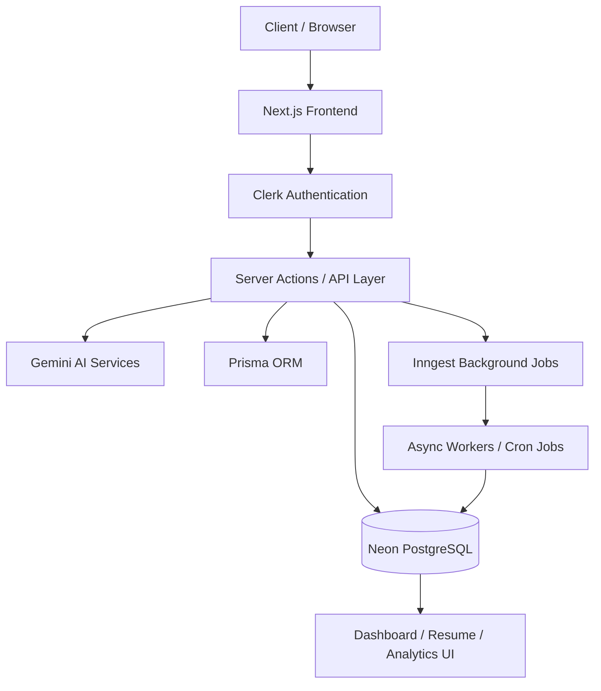

<p align="center">       </p> <p align="center"> <b> </b> </p>

## 🚀 Sensei — AI Career Intelligence Platform
  An AI-powered career intelligence platform that automates resume building, interview preparation, market analysis, and personalized job readiness workflows.

## 🌐 Live Demo
Sensei Live Application - 🔗 https://coach-d2gw.vercel.app/
 

## ✨ Product Vision

Modern job preparation is fragmented.

Candidates juggle:

resume builders, </br>
interview prep platforms, </br>
market research tools, </br>
cover letter generators, </br>
and career analytics dashboards separately. </br>

Sensei unifies the entire workflow into a single AI-native platform.

The system combines:

Generative AI,
event-driven architecture,
background processing,
structured AI pipelines,
and modern frontend engineering to deliver a scalable, production-ready SaaS experience.

## 🧠 Platform Capabilities
📄 AI Resume Intelligence Engine

An ATS-focused resume generation pipeline powered by structured AI prompting.

Features

✅ AI-enhanced bullet generation </br>
✅ Dynamic markdown-based resume rendering </br>
✅ One-click PDF export </br>
✅ ATS optimization workflow </br>
✅ Real-time form validation </br>
✅ Reusable resume templates </br>

#### Engineering Architecture

  
    ┌────────────────────┐
    │   User Input Layer │
    │ Resume Details Form│
    └─────────┬──────────┘
              │
              ▼
    ┌────────────────────┐
    │ Validation Layer   │
    │ React Hook Form +  │
    │ Zod Schema Checks  │
    └─────────┬──────────┘
              │
              ▼
    ┌────────────────────┐
    │ Prompt Builder     │
    │ Context Injection  │
    │ Structured Prompt  │
    └─────────┬──────────┘
              │
              ▼
    ┌────────────────────┐
    │ Gemini AI Engine   │
    │ JSON Response Gen  │
    └─────────┬──────────┘
              │
              ▼
    ┌────────────────────┐
    │ Response Parser    │
    │ Schema Validation  │
    │ Error Handling     │
    └─────────┬──────────┘
              │
              ▼
    ┌────────────────────┐
    │ Markdown Compiler  │
    │ Dynamic Templates  │
    └─────────┬──────────┘
              │
              ▼
    ┌────────────────────┐
    │ PDF Rendering Layer│
    │ html2pdf Export    │
    └────────────────────┘

#### Technical Highlights
Built schema-driven prompt orchestration for deterministic AI outputs
Reduced malformed AI responses using structured JSON prompting
Implemented reusable section-rendering architecture
Optimized rendering performance with client/server separation

## 🎯 Adaptive AI Interview System

A contextual interview engine that dynamically generates role-specific interview sessions.

Features

✅ Skill-aware questioning
✅ Dynamic interview generation
✅ AI-powered performance evaluation
✅ Analytical scoring dashboards
✅ Real-time session feedback

AI Workflow

  
                  ┌──────────────────┐
                │   User Input     │
                │ Skills / Resume  │
                └────────┬─────────┘
                         │
                         ▼
                ┌──────────────────┐
                │ Prompt Builder   │
                │ Context + Rules  │
                └────────┬─────────┘
                         │
                         ▼
                ┌──────────────────┐
                │   Gemini API     │
                │  AI Generation   │
                └────────┬─────────┘
                         │
                         ▼
                ┌──────────────────┐
                │ Response Parser  │
                │ JSON Validation  │
                └────────┬─────────┘
                         │
                         ▼
                ┌──────────────────┐
                │ UI Rendering     │
                │ Resume / Insights│
                └──────────────────┘
                                              
#### Engineering Highlights
Designed reusable interview orchestration pipeline </br>
Built analytical visualization system using Recharts </br>
Implemented modular AI evaluation utilities </br>
Optimized response consistency using structured outputs </br>

## 📈 Market Intelligence Pipeline

An asynchronous background-processing system delivering weekly career intelligence updates.

Features

✅ Salary trend tracking
✅ Industry demand analysis
✅ Automated weekly insights
✅ Cached market intelligence
✅ Skill trend monitoring

```text
        Weekly Cron Job
                ↓
        Inngest Workflow
                ↓
      Background Processing
      (Salary & Skill Trends)
                ↓
         Gemini Analysis
                ↓
       PostgreSQL Storage
                ↓
        Cached API Layer
                ↓
           Frontend UI
```
## Scalability Engineering

Architected event-driven cron workflows using Inngest
Minimized API overhead using scheduled caching
Improved frontend response latency significantly
Decoupled compute-heavy operations from UI rendering

## ✉️ Context-Aware Cover Letter Generator

AI-powered personalized cover letter generation engine.

Features

✅ Job-description-aware generation </br>
✅ Personalized tone adaptation  </br>
✅ Structured formatting pipeline  </br>
✅ Reusable prompt architecture  </br>

## AI Engineering
Built contextual prompt injection pipelines
Optimized generation consistency using schema enforcement
Reduced hallucinations with structured generation constraints


