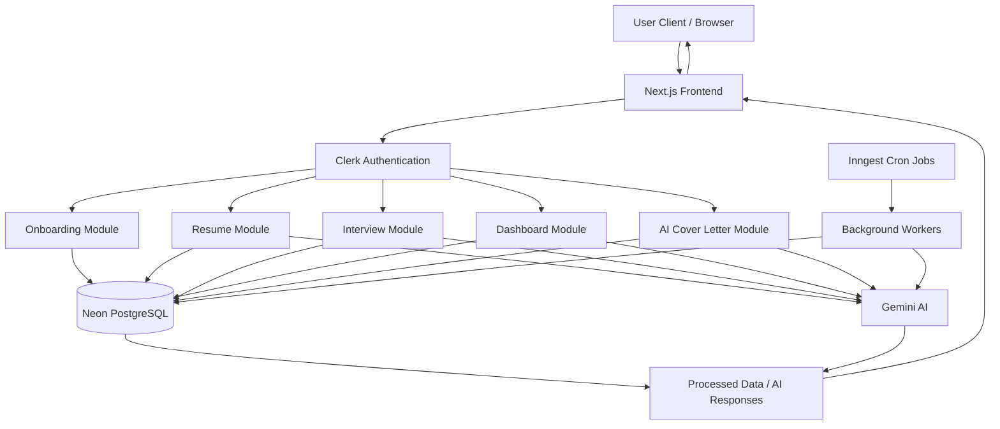

<p align="center">       </p> <p align="center"> <b> </b> </p>

## 🚀 Sensei — AI Career Intelligence Platform
  An AI-powered career intelligence platform that automates resume building, interview preparation, market analysis, and personalized job readiness workflows.

## 🌐 Live Demo
Sensei Live Application - 🔗 https://coach-d2gw.vercel.app/

# ⚙️ Running Locally

## Clone the Repository

```bash
git clone [<repository-url>](https://github.com/Ahad9044/coach.git)

```

## Install Dependencies

```bash
npm install
```

## Configure Environment Variables

Create a `.env` file in the root directory and add:

```env
NEXT_PUBLIC_CLERK_PUBLISHABLE_KEY= your clerk key
CLERK_SECRET_KEY= your clerk key
NEXT_PUBLIC_CLERK_SIGN_IN_URL=/sign-in
NEXT_PUBLIC_CLERK_SIGN_UP_URL=/sign-up
NEXT_PUBLIC_CLERK_AFTER_SIGN_UP_URL=/onboarding
NEXT_PUBLIC_CLERK_AFTER_SIGN_IN_URL=/onboarding

DATABASE_URL='your database url'
GEMINI_API_KEY =  your gemini api key
```

## Run Development Server

```bash
npm run dev
```

Application will be available at:

```bash
http://localhost:3000
```

## ✨ Product Vision

Modern job preparation is fragmented.

Candidates juggle:

resume builders, </br>
interview prep platforms, </br>
market research tools, </br>
cover letter generators, </br>
and career analytics dashboards separately. </br>

Sensei unifies the entire workflow into a single AI-native platform.

The system combines:

Generative AI,
event-driven architecture,
background processing,
structured AI pipelines,
and modern frontend engineering to deliver a scalable, production-ready SaaS experience.

## 🧠 Platform Capabilities
📄 AI Resume Intelligence Engine

An ATS-focused resume generation pipeline powered by structured AI prompting.

Features

✅ AI-enhanced bullet generation </br>
✅ Dynamic markdown-based resume rendering </br>
✅ One-click PDF export </br>
✅ ATS optimization workflow </br>
✅ Real-time form validation </br>
✅ Reusable resume templates </br>

#### Application Flow


~~~
┌────────────────────┐
│    User Access     │
│ Login / Dashboard  │
└─────────┬──────────┘
          │
          ▼
┌────────────────────┐
│ Authentication     │
│ Clerk Session Auth │
└─────────┬──────────┘
          │
          ▼
┌────────────────────┐
│ Frontend Modules   │
│ Resume / Interview │
│ Cover Letter / UI  │
└─────────┬──────────┘
          │
          ▼
┌────────────────────┐
│ Form Management    │
│ React Hook Form    │
│ + Zod Validation   │
└─────────┬──────────┘
          │
          ▼
┌────────────────────┐
│ Prompt Builder     │
│ Context Injection  │
│ Structured Prompts │
└─────────┬──────────┘
          │
          ▼
┌────────────────────┐
│ Gemini AI Engine   │
│ AI Content Gen     │
└─────────┬──────────┘
          │
          ▼
┌────────────────────┐
│ Response Parser    │
│ JSON Validation    │
│ Error Handling     │
└─────────┬──────────┘
          │
          ├──────────────┐
          ▼              ▼
┌────────────────┐  ┌────────────────┐
│ NeonDB Storage │  │ PDF Generation │
│ Prisma ORM     │  │ html2pdf       │
└────────┬───────┘  └────────────────┘
         │
         ▼
┌────────────────────┐
│ Dashboard &        │
│ Analytics Layer    │
│ Recharts Insights  │
└─────────┬──────────┘
          │
          ▼
┌────────────────────┐
│ Background Jobs    │
│ Inngest Cron Tasks │
│ Industry Insights  │
└────────────────────┘

~~~

#### Technical Highlights
Built schema-driven prompt orchestration for deterministic AI outputs
Reduced malformed AI responses using structured JSON prompting
Implemented reusable section-rendering architecture
Optimized rendering performance with client/server separation

## 🎯 Adaptive AI Interview System

A contextual interview engine that dynamically generates role-specific interview sessions.

Features

✅ Skill-aware questioning  </br>
✅ Dynamic interview generation  </br>
✅ AI-powered performance evaluation  </br>
✅ Analytical scoring dashboards  </br>
✅ Real-time session feedback  </br>

AI Workflow

 ~~~ 
 User Input
   ↓
Structured Prompt Builder
   ↓
Gemini AI Generation
   ↓
Response Parsing & Validation
   ↓
Frontend Rendering
   ↓
Resume / Insights Output
~~~
                                              
#### Engineering Highlights
Designed reusable interview orchestration pipeline </br>
Built analytical visualization system using Recharts </br>
Implemented modular AI evaluation utilities </br>
Optimized response consistency using structured outputs </br>

## 📈 Market Intelligence Pipeline

An asynchronous background-processing system delivering weekly career intelligence updates.

Features

✅ Salary trend tracking </br>
✅ Industry demand analysis  </br>
✅ Automated weekly insights  </br>
✅ Cached market intelligence  </br>
✅ Skill trend monitoring  </br>

## Scalability Engineering

Architected event-driven cron workflows using Inngest
Minimized API overhead using scheduled caching
Improved frontend response latency significantly
Decoupled compute-heavy operations from UI rendering


## AI Engineering
Built contextual prompt injection pipelines
Optimized generation consistency using schema enforcement
Reduced hallucinations with structured generation constraints

 ## System design of the Application 


