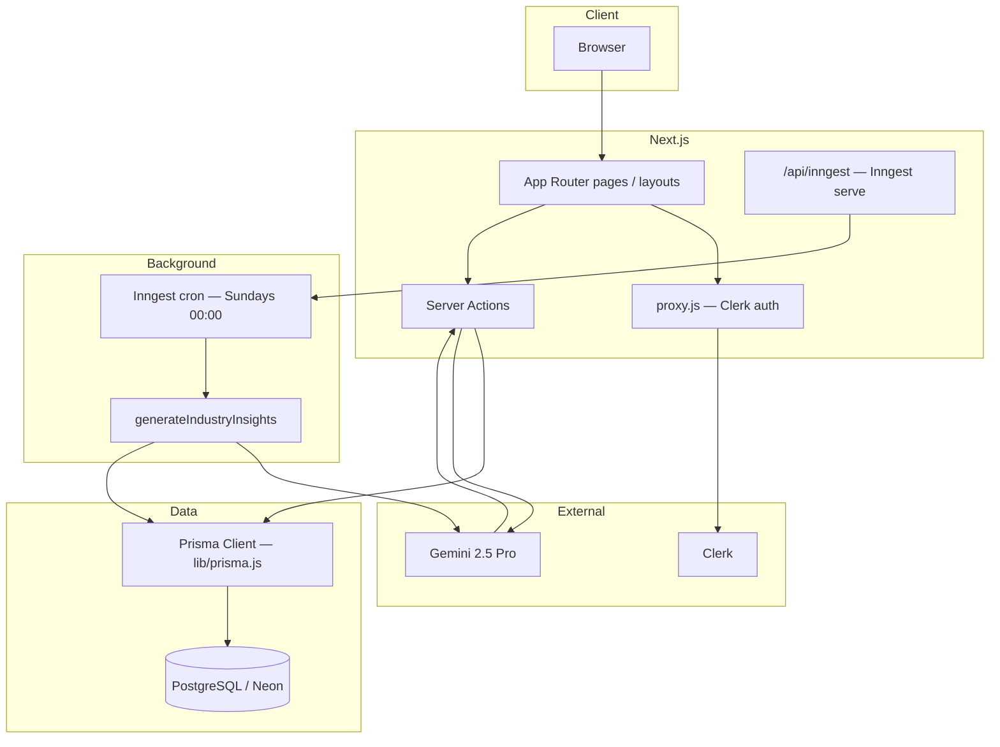

<p align="center">
  
  
  
  
  
  
</p>

# Sensei — AI Career Intelligence Platform

An AI-powered career intelligence platform that unifies resume building, interview preparation, market insights, and cover letter generation into a single Next.js application.

**Live demo:** [https://coach-d2gw.vercel.app/](https://coach-d2gw.vercel.app/)

---

## Table of contents

- [Tech stack](#tech-stack)
- [Architecture](#architecture)
- [Project structure](#project-structure)
- [Application routes](#application-routes)
- [Data model](#data-model)
- [AI & background jobs](#ai--background-jobs)
- [Getting started](#getting-started)
- [Environment variables](#environment-variables)
- [Platform capabilities](#platform-capabilities)

---

## Tech stack

| Layer | Technology |
|-------|------------|
| Framework | [Next.js 16](https://nextjs.org) (App Router) |
| UI | React 19, [Tailwind CSS 4](https://tailwindcss.com), [shadcn/ui](https://ui.shadcn.com) (Radix primitives) |
| Auth | [Clerk](https://clerk.com) (`proxy.js` middleware) |
| Database | PostgreSQL via [Neon](https://neon.tech), [Prisma ORM](https://www.prisma.io) |
| AI | Google [Gemini 2.5 Pro](https://ai.google.dev) (`@google/generative-ai`) |
| Forms | React Hook Form + [Zod](https://zod.dev) |
| Charts | [Recharts](https://recharts.org) |
| PDF | `@react-pdf/renderer`, `html2pdf.js` |
| Markdown | `@uiw/react-md-editor`, `marked` |
| Background jobs | [Inngest](https://www.inngest.com) (weekly industry insight refresh) |
| Deployment | Vercel |

---

## Architecture

Sensei follows a **Next.js App Router** pattern: UI routes under `app/`, business logic in **Server Actions** (`actions/`), shared utilities in `lib/`, and Prisma for persistence. AI calls use structured JSON prompts; responses are parsed and stored in PostgreSQL.



### Request flow (typical AI feature)

1. User submits a form on a client component (React Hook Form + Zod).
2. Client invokes a **Server Action** in `actions/` (auth via Clerk `auth()`).
3. Action builds a structured prompt, calls Gemini, strips markdown fences, and `JSON.parse`s the result.
4. Result is persisted with Prisma and paths are revalidated where needed.
5. UI refreshes with server-rendered or client state.

### Auth & onboarding

- `proxy.js` protects: `/dashboard`, `/resume`, `/ai-cover-letter`, `/onboarding`.
- `lib/checkUser.js` syncs Clerk users into the `User` table on each request (via `Header`).
- After sign-in/up, Clerk redirects to `/onboarding`; completed profiles redirect to `/dashboard`.

---

## Project structure

```
coach/
├── actions/                    # Server Actions (AI + DB)
│   ├── user.js                 # Profile / onboarding updates
│   ├── resume.js               # Save, fetch, ATS scoring
│   ├── interview.js            # Quiz generation & assessments
│   ├── cover-letter.js         # Cover letter CRUD + generation
│   └── dashboard.js            # Industry insights (on-demand + read)
│
├── app/
│   ├── layout.js               # Root layout (Clerk, theme, header, footer)
│   ├── page.jsx                # Marketing landing page
│   ├── globals.css
│   ├── not-found.jsx
│   ├── lib/
│   │   ├── schema.js           # Zod schemas (onboarding, resume, contact)
│   │   └── helper.js           # Resume markdown helpers
│   ├── (auth)/                 # Clerk sign-in / sign-up
│   │   ├── layout.jsx
│   │   ├── sign-in/[[...sign-in]]/page.jsx
│   │   └── sign-up/[[...sign-up]]/page.jsx
│   ├── (main)/                 # Authenticated app shell (container layout)
│   │   ├── layout.jsx
│   │   ├── onboarding/         # Industry, skills, experience setup
│   │   ├── dashboard/          # Industry insights & charts
│   │   ├── resume/             # Resume builder + PDF export
│   │   ├── interview/          # Quiz history, stats, mock interview
│   │   └── ai-cover-letter/    # List, create, view cover letters
│   └── api/
│       └── inngest/route.js    # Inngest HTTP handler
│
├── components/
│   ├── Header.jsx              # Nav + Clerk UI + checkUser
│   ├── Hero.jsx
│   ├── theme-provider.jsx
│   └── ui/                     # shadcn/ui primitives
│
├── data/                       # Static marketing content
│   ├── features.js
│   ├── faqs.js
│   ├── howItWorks.js
│   ├── industries.js
│   └── testimonial.js
│
├── hooks/
│   └── use-fetch.js            # Client wrapper for async actions + toast errors
│
├── lib/
│   ├── prisma.js               # Lazy Prisma singleton (Proxy)
│   ├── checkUser.js            # Clerk → DB user sync
│   ├── utils.js                # cn() and shared utilities
│   └── injest/                 # Inngest client + cron functions
│       ├── client.js
│       └── functions.js
│
├── prisma/
│   ├── schema.prisma           # User, Resume, Assessment, CoverLetter, IndustryInsight
│   └── migrations/
│
├── public/                     # Static assets (logo2.png, banner2.jpeg)
├── proxy.js                    # Clerk middleware (route protection)
├── next.config.mjs
├── postcss.config.mjs
├── components.json             # shadcn/ui config
└── package.json
```

---

## Application routes

| Route | Purpose | Auth |
|-------|---------|------|
| `/` | Landing page (features, FAQ, testimonials) | Public |
| `/sign-in`, `/sign-up` | Clerk authentication | Public |
| `/onboarding` | Industry, bio, experience, skills | Protected |
| `/dashboard` | Industry insights, salary ranges, trends | Protected (requires onboarding) |
| `/resume` | AI-assisted resume builder & PDF | Protected |
| `/interview` | Assessment history & performance charts | Server actions require auth |
| `/interview/mock` | Live AI-generated quiz session | Server actions require auth |
| `/ai-cover-letter` | Cover letter list | Protected |
| `/ai-cover-letter/new` | Generate new cover letter | Protected |
| `/ai-cover-letter/[id]` | View / edit cover letter | Protected |
| `/api/inngest` | Inngest webhook & function registration | Inngest |

---

## Data model

Defined in `prisma/schema.prisma`:

| Model | Description |
|-------|-------------|
| **User** | Clerk-linked profile (`clerkUserId`), industry, skills, bio, experience |
| **Resume** | One markdown resume per user; optional `atsScore` and `feedback` |
| **Assessment** | Interview quiz attempts (`questions` JSON, `quizScore`, category, AI tip) |
| **CoverLetter** | Generated letters with job title, company, optional job description |
| **IndustryInsight** | Cached market data per industry (salaries, trends, skills, outlook) |

`User.industry` references `IndustryInsight.industry` for dashboard personalization.

---

## AI & background jobs

### Gemini usage

All generation modules use **`gemini-2.5-pro`** with prompts that require **JSON-only** responses. Server Actions clean fenced code blocks before parsing:

- **Resume** — ATS scoring and feedback (`actions/resume.js`)
- **Interview** — 10-question MCQ quizzes tailored to industry/skills (`actions/interview.js`)
- **Cover letter** — Role-specific letters from profile + job description (`actions/cover-letter.js`)
- **Dashboard** — Industry insight payloads on onboarding or cache miss (`actions/dashboard.js`)

### Inngest

- Client: `lib/injest/client.js` (`id: "ai-coach"`)
- Cron function: `generateIndustryInsights` — runs **every Sunday at midnight**, refreshes all `IndustryInsight` rows
- Served at: `app/api/inngest/route.js`

For local Inngest dev, use the [Inngest Dev Server](https://www.inngest.com/docs/local-development) and point it at `/api/inngest`.

---

## Getting started

### Prerequisites

- Node.js 18+
- PostgreSQL database (e.g. [Neon](https://neon.tech))
- [Clerk](https://clerk.com) application
- [Google AI](https://aistudio.google.com/apikey) API key (Gemini)

### 1. Clone and install

```bash
git clone https://github.com/Ahad9044/coach.git
cd coach
npm install
```

### 2. Environment variables

Create `.env` in the project root (see [Environment variables](#environment-variables)).

### 3. Database setup

```bash
npx prisma migrate deploy
# or for local dev:
npx prisma db push
```

`postinstall` runs `prisma generate` automatically after `npm install`.

### 4. Run the development server

```bash
npm run dev
```

Open [http://localhost:3000](http://localhost:3000).

### Scripts

| Command | Description |
|---------|-------------|
| `npm run dev` | Start Next.js dev server |
| `npm run build` | Production build |
| `npm run start` | Start production server |
| `npm run lint` | Run ESLint |

---

## Environment variables

```env
# Clerk
NEXT_PUBLIC_CLERK_PUBLISHABLE_KEY=
CLERK_SECRET_KEY=
NEXT_PUBLIC_CLERK_SIGN_IN_URL=/sign-in
NEXT_PUBLIC_CLERK_SIGN_UP_URL=/sign-up
NEXT_PUBLIC_CLERK_AFTER_SIGN_UP_URL=/onboarding
NEXT_PUBLIC_CLERK_AFTER_SIGN_IN_URL=/onboarding

# Database (Neon PostgreSQL connection string)
DATABASE_URL=

# Google Gemini
GEMINI_API_KEY=
```

---

## Platform capabilities

### AI Resume Intelligence

- Section-based resume builder (experience, education, skills, contact)
- Markdown composition via `entriesToMarkdown` (`app/lib/helper.js`)
- AI ATS score and feedback
- PDF export (`ResumePDF.jsx`, `html2pdf.js`)

### Adaptive Interview System

- AI-generated MCQ quizzes based on industry and skills
- Mock interview flow at `/interview/mock`
- Performance charts and history (`Recharts`, `Assessment` model)

### Market Intelligence Dashboard

- Industry-specific salary ranges, demand, growth rate, and trends
- Insights generated on onboarding and cached in `IndustryInsight`
- Weekly refresh via Inngest cron

### AI Cover Letters

- Job-targeted generation from user profile
- Draft listing and per-letter detail pages
- Markdown preview and editing

---

## Product vision

Modern job preparation is fragmented across resume tools, interview platforms, market research, and cover letter generators. Sensei unifies these workflows in one AI-native SaaS experience using generative AI, structured prompting, event-driven background jobs, and a production-ready Next.js stack.

---

<p align="center">Made with ❤️ by Ahad</p>
